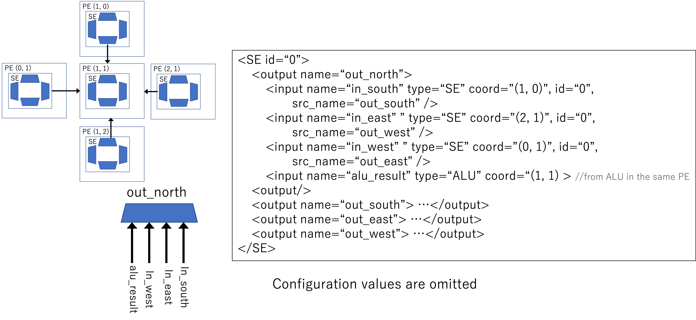

# Architecture description
A target CGRA is defined with an XML file.
The top-level element is `<PEArray>`.

## Syntax of `<PEArray>`
```
<PEArray name="NAME" width="WIDTH" height="HEIGHT" input_port="N" output_port="N" inout_port="N" const_reg="N" >
```
1. name (string): the name of the architecture
2. width (int): the width of the array
3. height (int): the height of the array
4. input_port (int): the number of data input ports
5. output_port (int): the number of data output ports
6. inout_port (int): the number of data IO ports
7. const_reg (int): the number of constant registers

The `input_port` and `output_port` create isolated ports for the data input and output,
while `inout_port` creates shared ports for both.
If both `inout_port` and `input_port` are specified, `input_port` is ignored.
The same is true of `output_port`.

`const_reg="X"` means no dedicated register for constant values in the CGRA.

The `<PEArray>` should have the following inner elements
1. `<PE>`
2. `<IN_PORT>`
3. `<OUT_PORT>`

## Syntax of `<PE>`
It describes the structure of a PE
```
<PE coord=“(0, 0)” >
	<ALU>
	…
	<ALU/>
	<SE id=“0”>
	…
	<SE/>
	…
<PE/>
```

A PE is assumed to have a single ALU and multiple SEs.

To specify the position of the PE, a "coord" attribute is needed, which is a coordinate representation in the 2D array (width x height) with zero-based indexing.

### Syntax of `<ALU>`
It defines an ALU in the PE.
```
<ALU [mux_num=“N”] >
	<operation …>
	<operation …>
	...
	<input …>
	<input …/>
	...
<ALU/>
```
"mux_num" is an optional attribute that specifies the number of input multiplexers (default: 2).
The inner elements are a list of `<operation>` and a list of  `<input>`.
The former indicates supported instructions in the ALU.
The latter makes connections between other elements and this ALU.

### Syntax of `<operation>`
It defines an operation of the ALU
```
<operation value=“N">opcode</operation>
```
It requires the "value" attribute as a configuration value (integer) to assign the operation to the ALU.

The inner text is a string of the opcode like "add" and "mult", etc.

If the `<operation>` has an additional attribute `route="true"`, it means the ALU can work as a routing resource when this operation is assigned.

### Syntax of `<input>`
It defines a connection.

```
<input name=“name” value=“N” type=“element_type” … />
```
It requires at least three attributes:
1. name (string): any name of the connection you like
2. value (integer): the configuration value when the connection is activated.
3. type (string): which type of resources is connected. The types are as follows:
	* ALU: connecting signals from an ALU
	* SE: connecting signals from an SE output channel
	* IN_PORT: connecting signals from an input port
	* Const: connecting signals from a constant register
	
Some additional attributes for each connection type are required.
* coord="(x, y)": the coordinate of PE in which the ALU or SE is included
* id="ID": the ID of SE to be connected
* src_name="src_name": the output channel name of connected SE
* index="i": index of the input port or constant register

In addition,  `<input>` element can have `weight="W"` attribute as a link const (float) of this connection.

Examples:
1. It  connects signals of ALU output in PE (0, 0) and names the connection ALU
```
<input name="ALU" type="ALU" value="0", coord="(0,0)"/>
```

2. An output channel named “OUT_WEST” of SE (ID=0) included in the PE (1, 0) is connected
```
<input name="IN_EAST" type="SE" id="0" value="2" src_name="OUT_WEST”
	 coord="(1, 0)"/>
```	 

3. It connects signals of 0-th input port
```
<input name="IN_SOUTH" type="IN_PORT" value="1" index="0" />
```

4. It connects signals of 0-th constant register
```
<input name="IN_CONST_A" type="Const" value="6" index="0"/>
```

### Syntax of `<SE>`
It defines a switch element composed of a set of multiplexers.

```
<SE id=“ID”>
	<output name=“name”>
		<input …>
		<input …>
		…
	<output/>
	<output …>…<output/>
	…
<SE/>
```

It requires the "id" attribute, ID number of the switch element.
The ID is used to distinguish SEs in a PE.

The inner elements are a list of output elements corresponding to a multiplexer.

Each output element must have "name" attribute to name the output channel.
Each of them has a list of `<input>` elements as inner elements.



The above example defines a SE with four output channels.

## Syntax of `<IN_PORT>`
`<IN_PORT>` element is optional.
It specifies the position of the port (left, right, top, bottom) with the "pos" attribute.
However, the position information is used only for mapping visualization.

```
<IN_PORT index="0" pos="left"/>
```

## Syntax of `<OUT_PORT>`
It makes connections between an output port and other resources.

```
<OUT_PORT index="N">
	<input …>
	<input …>
	…
<OUT_PORT/>
```

To identify the output port, the "index" attribute is needed.
Like `<ALU>` and `<output>` in `<SE>`, inner elements of `<input>` defines connections.
Similar to `<IN_PORT>`, it can have "pos" attribute as the position information.