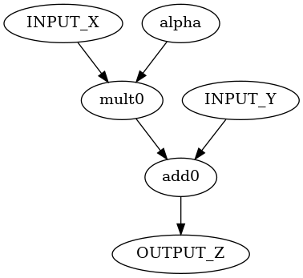

# Writing an application
A data-flow-graph (DFG) file in DOT format is needed for mapping.

The following example is a DFG for SAXPY `Z = a * X + Y`.

```
digraph{
	# inputs
	"INPUT_X" [type=input]
	"INPUT_Y" [type=input]

	# operations
	"add0" [type=op,opcode=add]
	"mult0" [type=op,opcode=mult]

	# constants
	"alpha" [type=const,datatype=float32,value=1.234]

	# outputs
	"OUTPUT_Z" [type=output]

	# dependencies
	"INPUT_X" -> "mult0" [operand=0]
	"alpha" -> "mult0" [operand=1]
	"mult0" -> "add0" [operand=0]
	"INPUT_2" -> "add0" [operand=1]
	"add0" -> "OUTPUT_Z"
}
```




## Nodes 
The nodes are categorized into four types: computational, input, output, and constant.

### Computational node (`type=op`)
Each computational node means an operation in a DFG. It must have an attribute `opcode`.

### Input node (`type=input`)
An input node indicates data loaded from memory.

### Output node (`type=output`)
A store node means a value to be stored in memory.

### Constant node (`type=const`)
The constant nodes are constant values during the computation.
Each node can have the following attributes:

* `datatype`: type of the constant value
	* available types
		* int[8,16,32,64]
		* uint[8,16,32,54]
		* float[16,32,64]
	* type alias
		* ubyte = uint8
		* byte = int8
		* ushort = uint16
		* short = int16
		* uintc = uint32
		* intc = int32
		* uint = uint32
		* int = int32
		* half = float16
		* float = float32
		* single = float32
		* double = float64
* `value`: the constant value

If the data type is not specified, the value is assumed as `int` type.
If the value cannot be decoded as the specified, the generated configuration file contains all zero data for the node. 
If the integer type value starts with "0x", it is decoded as hexadecimal.

## Edges
An edge means a data dependency between nodes.
Each edge can have an attribute `operand, which specifies the operand order for the sink node.
